# Tech Challenge 2 - End-to-End CI/CD Deployment on Amazon EKS

## Project Overview

This project demonstrates the complete deployment lifecycle of a containerized web application using modern DevOps practices and AWS cloud services.

A simple Node.js "Hello World" application was containerized with Docker, pushed to Amazon Elastic Container Registry (Amazon ECR), deployed to Amazon Elastic Kubernetes Service (Amazon EKS) using Kubernetes and Helm, provisioned with Terraform, automated with a Jenkins CI/CD pipeline, and continuously managed through GitOps using Argo CD.

This project demonstrates practical experience with Infrastructure as Code (IaC), containerization, Kubernetes orchestration, Continuous Integration/Continuous Deployment (CI/CD), and GitOps while following cloud engineering best practices.

## Technologies Used

| Technology | Purpose |
|------------|---------|
| Node.js | Developed the Hello World web application |
| Docker | Containerized the application |
| Amazon Elastic Container Registry (ECR) | Stored Docker container images |
| Terraform | Provisioned AWS infrastructure as Infrastructure as Code (IaC) |
| Amazon Elastic Kubernetes Service (EKS) | Hosted the Kubernetes cluster |
| Kubernetes | Deployed and managed the application containers |
| Helm | Packaged and deployed Kubernetes resources |
| Jenkins | Automated the CI/CD pipeline |
| Argo CD | Implemented GitOps continuous deployment |
| GitHub | Version control and source code management |
| Visual Studio Code | Development environment |

## Project Workflow

The deployment followed this end-to-end workflow:

1. Develop the Node.js Hello World application.
2. Build a Docker image.
3. Push the Docker image to Amazon Elastic Container Registry (ECR).
4. Provision AWS infrastructure using Terraform.
5. Create an Amazon EKS cluster.
6. Deploy the application using Kubernetes manifests.
7. Package and manage the deployment with Helm.
8. Automate builds and deployments using Jenkins.
9. Synchronize deployments through Argo CD GitOps.
10. Verify the application through the AWS Load Balancer.
11. Document the completed project and publish it to GitHub.


## Repository Structure

```text
tech-challenge-2-corrected/
├── app/                     # Node.js Hello World application
├── terraform/               # Infrastructure as Code (IaC)
├── kubernetes/              # Kubernetes manifests
├── helm/
│   └── hello-world-chart/   # Helm chart
├── jenkins/
│   └── Jenkinsfile          # CI/CD pipeline
├── screenshots/             # Project documentation images
└── README.md                # Project documentation
```


## Skills Demonstrated

This project demonstrates practical experience with:

- Infrastructure as Code (Terraform)
- AWS Cloud Infrastructure (Amazon EKS, Amazon ECR)
- Docker containerization
- Kubernetes application deployment
- Helm package management
- Jenkins Continuous Integration / Continuous Deployment (CI/CD)
- GitOps using Argo CD
- GitHub version control
- Cloud troubleshooting and problem resolution
- Technical documentation and project organization


## Project Results

- Successfully provisioned an Amazon EKS cluster using Terraform.
- Created a production-style VPC with public and private subnets.
- Configured a managed Amazon EKS node group.
- Deployed a containerized application from Amazon ECR.
- Exposed the application through an AWS LoadBalancer.
- Verified Kubernetes node health and system pods.
- Successfully displayed the application in a web browser.
- Resolved a real-world EKS NodeCreationFailure through infrastructure troubleshooting.

## Business Value

This project demonstrates how modern organizations can automate the deployment and management of containerized applications using Amazon EKS, Terraform, and Kubernetes. By defining infrastructure as code and deploying applications through Kubernetes, companies can reduce manual configuration, improve consistency, and accelerate software delivery.

Implementing this solution helps organizations:

Automate infrastructure deployment, reducing manual setup time and minimizing configuration errors.
Improve application reliability through Kubernetes self-healing capabilities that automatically replace failed containers.
Scale applications efficiently by allowing Kubernetes to add or remove application instances based on demand.
Increase deployment consistency by using Terraform to provision identical environments across development, testing, and production.
Strengthen disaster recovery because infrastructure can be recreated quickly from version-controlled code.
Support continuous integration and continuous deployment (CI/CD) by integrating Kubernetes with source control and deployment pipelines.
Reduce operational costs by using managed AWS services such as Amazon EKS and scaling resources only when needed.
Improve security and governance through AWS IAM, private networking, and controlled access to infrastructure resources.
Increase developer productivity by allowing development teams to focus on application development while infrastructure provisioning and deployment are automated.


## Business Problem Solved

Many organizations struggle with manual infrastructure deployment, inconsistent environments, application downtime, and lengthy release cycles.

This project solves those challenges by implementing Infrastructure as Code with Terraform and container orchestration through Amazon EKS. The result is a repeatable, scalable, and highly available deployment process that reduces operational overhead while improving application reliability and deployment speed.


## Lessons Learned

Throughout this project, I gained hands-on experience deploying containerized applications using modern DevOps tools and AWS services. I strengthened my understanding of Infrastructure as Code, Kubernetes, CI/CD automation, GitOps, and cloud troubleshooting. Most importantly, I learned the value of systematically verifying each deployment step, resolving issues methodically, and documenting the complete solution in a professional manner.


## Project Screenshots

The following screenshots document each major phase of the project from application development through GitOps deployment.

### 1. Project Structure

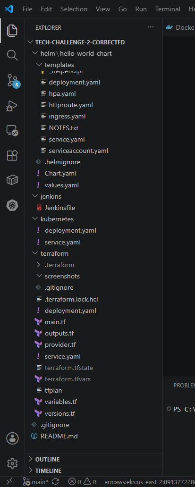

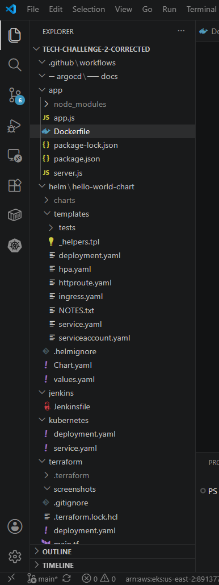

---

### 2. Hello World Application

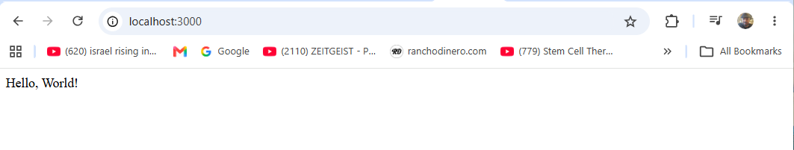

---

### 3. Docker Build

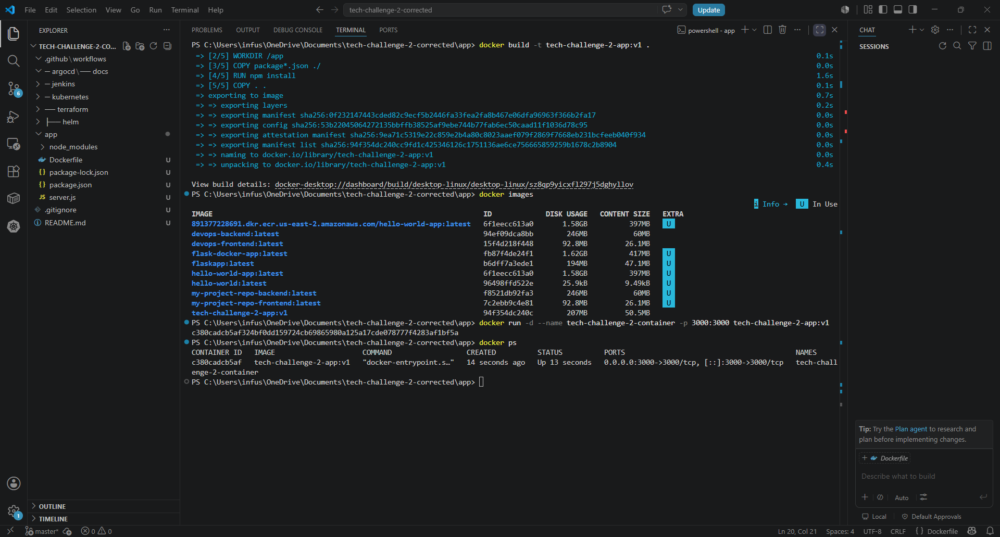

---

### 4. Amazon ECR Repository

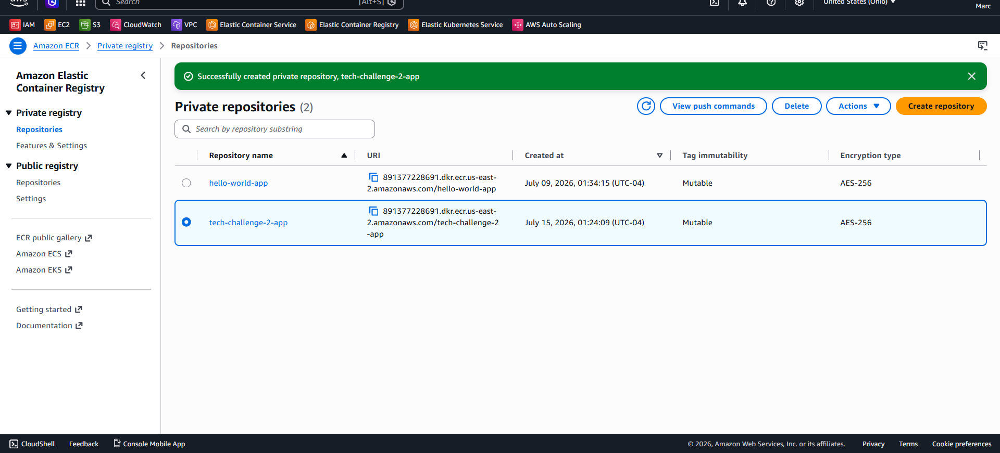

---

### 5. Terraform Infrastructure Deployment

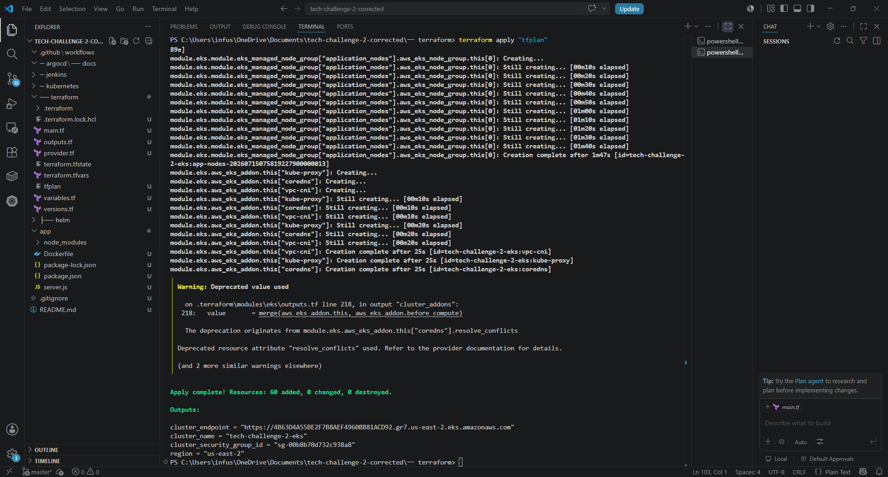

---

### 6. Amazon EKS Cluster

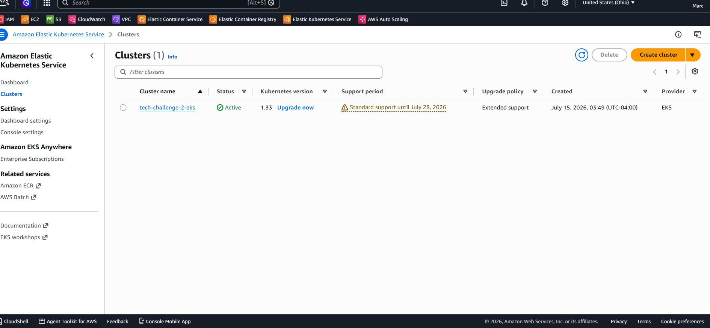

---

### 7. Kubernetes Cluster Verification


---

### 8. Kubernetes Deployment

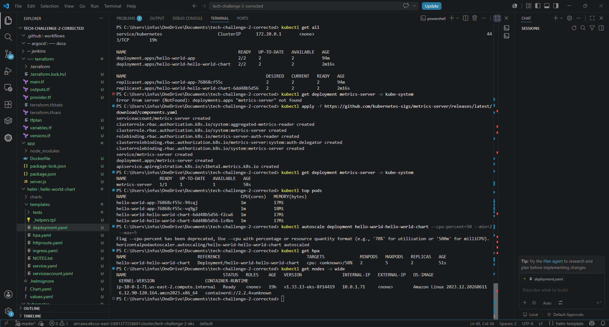

---

### 9. Application Through Load Balancer

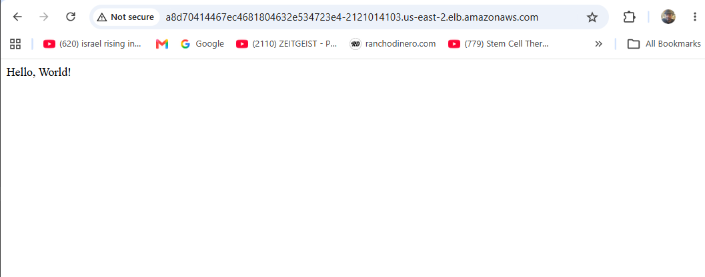

---

### 10. Helm Deployment

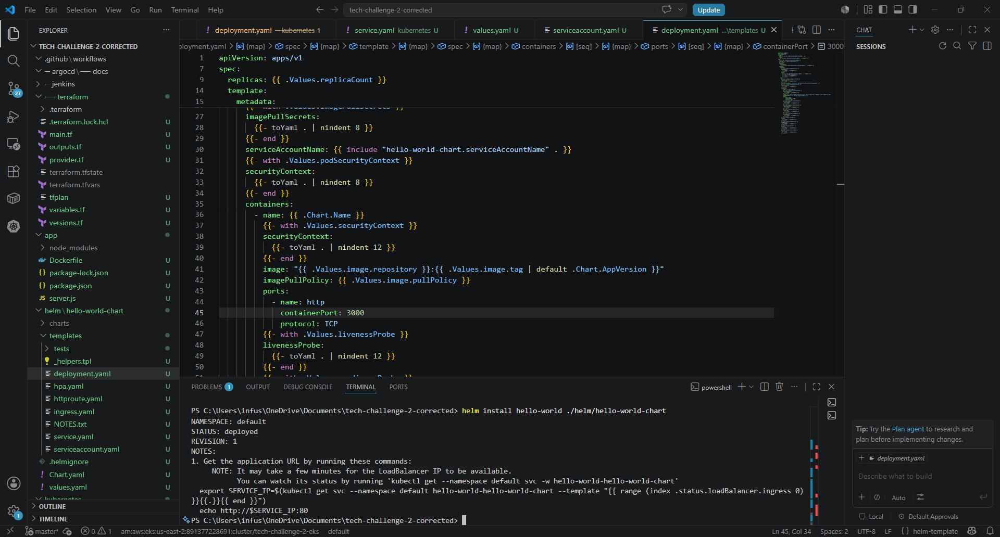

---

### 11. Jenkins CI/CD Pipeline

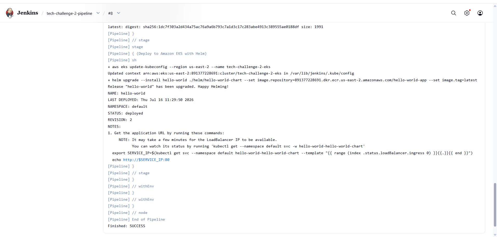

---

### 12. Argo CD Application

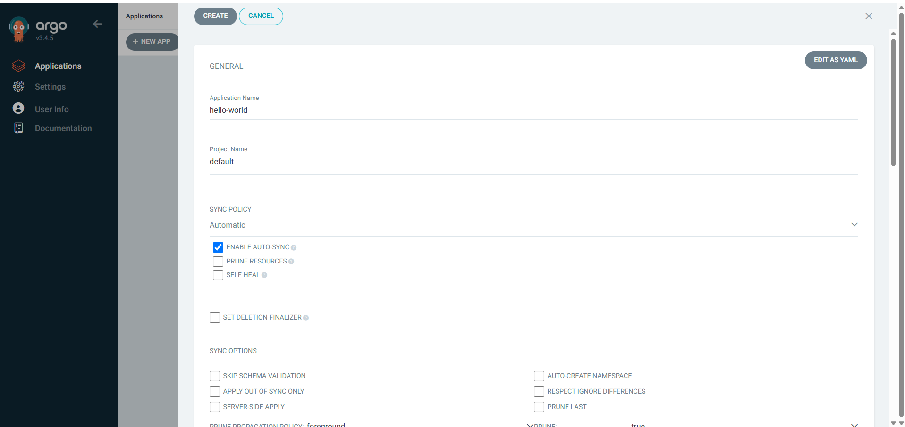

---

### 13. Argo CD Healthy & Synced

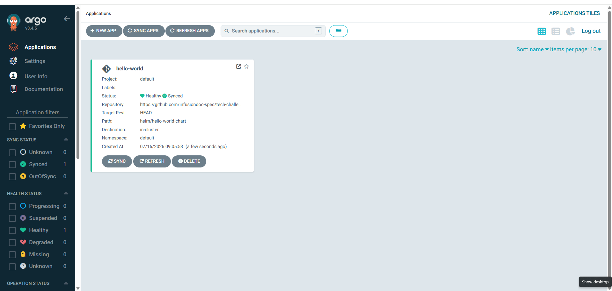s

---

### 14. Final GitHub Repository

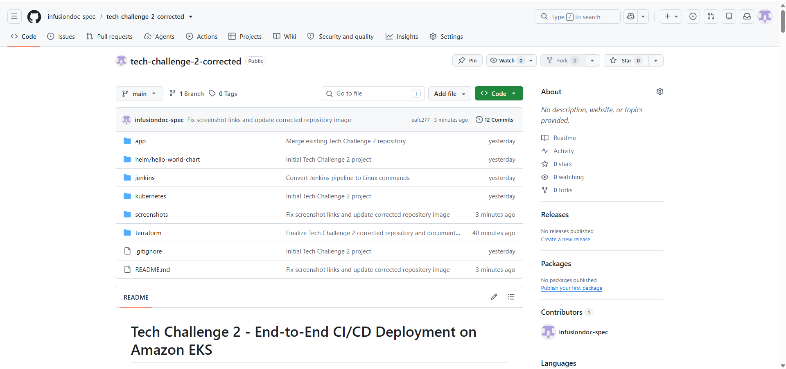